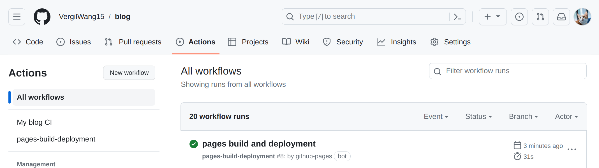
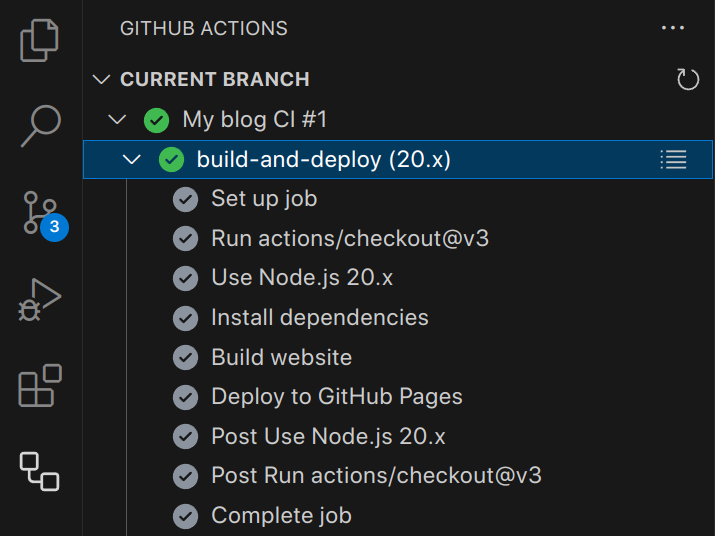
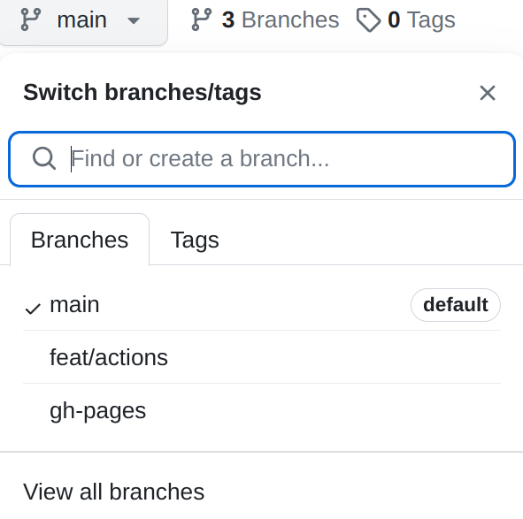

<div style={{ display: 'flex', justifyContent: 'space-around', alignItems: 'center' }}>
  
  
  
</div>

[//]: # (TODO:Build a free image hosting service with github, then replace the images above)


Today, I utilized Github actions to successfully build and deploy my website, which is now smoothly hosted on [my Github Pages](https://vergilwang15.github.io/blog/). I am going to share my experience here.

## What are Github Actions and Github Pages?

Github Actions is a CI/CD tool provided by Github. It is free for public repositories and has certain amount of free minutes for private repositories (2,000 minutes per month in 01/08/2024).

Github Pages is a service that allows you to host static websites directly from your Github repository. The service is free and supports custom domains, which can be used in unlimited public repositories.
<!--truncate-->

## Why do I use these two services?

- Cost-Effective: They are free
- User-Friendly: They are easy to use and well-integrated with Github
- Accessiblity: Documentation is clear and everywhere


## Create A Workflow File

Create a `.yml` file (In my cases, it's `website_ci.yml`) under`.github/workflows/` folder. When you commit this file, Github Actions will automatically run the workflow.

## Configure the Workflow

<details>
<summary>`website_ci.yml`, click to expand</summary>

```yml
name: My blog CI 

on:
  push:
    branches: [ "main" ]
  pull_request:
    branches: [ "main" ]

permissions:
  contents: write

jobs:
  build-and-deploy:
    concurrency: ci-${{ github.ref }} 
    runs-on: ubuntu-latest

    strategy:
      matrix:
        node-version: [18.x, 20.x]

    steps:
    - uses: actions/checkout@v3
    - name: Use Node.js ${{ matrix.node-version }}
      uses: actions/setup-node@v3
      with:
        node-version: ${{ matrix.node-version }}
        cache: 'npm'

    - name: Install dependencies
      run: npm install

    - name: Build website
      run: |
        npm ci
        npm run build

    - name: Deploy to GitHub Pages
      uses: JamesIves/github-pages-deploy-action@v4
      with:
        folder: build # The folder the action should deploy.
```
</details>

I use the following steps to configure a workflow:

1. Configure the workflow itself

    This part is used to configure the workflow itself, including:
    - Set your workflow's name
    - Set the event that triggers the workflow, in my case, it's `push` or `pull_request` to `main` branch
    - Set the permission of the workflow, in my case, it's `contents: write`, which means the workflow can write to the repository

2. Configure the jobs

    This part is used to configure the jobs in the workflow, including:
    - Set the name of the job, in my case, it's `build-and-deploy`
    - Set the concurrency of the job, in my case, it's `ci-${{ github.ref }}`, which means the job will run concurrently with the same ref
    - Set the environment of the job, in my case, it's `ubuntu-latest`, which means the job will run on the latest version of Ubuntu
    - Set the strategy of the job, in my case, it's `node-version: [18.x, 20.x]`, which means the job will run on two versions of Node.js. I use this because I want to test if my website can be built on different versions of Node.js

3. Configure the steps

    Steps are the most important part of the workflow, which contains the actual actions that will be executed. In my case, I use the following steps:

    - `actions/checkout@v3`: This action is used to checkout the repository to the runner, which means the runner will have access to the repository
    - `actions/setup-node@v3`: This action is used to setup Node.js on the runner
    - `npm install`: This step is used to install dependencies, which is required to build the docusaurus website, you can also use yarn which is more recommended by docusaurus
    - `npm ci`: This step is used to install dependencies with clean cache listed in the package-lock.json file
    - `npm run build`: This step is used to build the website, which will generate a `build` folder containing the static website

    After these steps, the website is built and ready to be deployed.

4. Configure the deployment

    I used [JamesIves/github-pages-deploy-action](https://github.com/JamesIves/github-pages-deploy-action/tree/v4/) to deploy my website. This action will create a new branch called `gh-pages` and push the `build` folder (you can specify the folder in the action) to the branch. 

## Push the Workflow File to your Repository

After you commit it to Github (main branch here), Github Actions will automatically run the workflow. You can check the status here:



If you are using vscode, you can install a [Github Actions extension](https://marketplace.visualstudio.com/items?itemName=GitHub.vscode-github-actions) to check the status of your workflow. It also provides some convient features like highlighting the actions you are using, which can be clicked to view the Github repo of the action.



## Configure Github Pages

After Gihub Actions is finished, the workflow will create a new branch called `gh-pages` on your repository. You can check it here:



Then, you can go to the `Settings` tab of your repository and scroll down to the `Github Pages` section. 

- Select `Deploy from a branch` as the source
- Select the `gh-pages` as the branch
- Select the `/ (root)` as the folder

Github Pages will automatically start a Github Actions called `pages-build-deployment` to deploy your website. After it's finished, you can access your website at `https://<your-github-username>.github.io/<your-repository-name>/`.

You can also use a custom domain for your website. And Github provides a [detailed guide](https://docs.github.com/en/pages/configuring-a-custom-domain-for-your-github-pages-site) for this.

## Modify the `docusaurus.config.js` file

`docusaurus.config.js` is the configuration file of docusaurus. It contains the basic information of the website, including the plugins, the theme, layout, i18n, etc.

The thing was not done yet after I configured the Github Pages. The website was truly deployed, but it didn't work as expected.

The reason why it didn't work is that the `baseUrl` in the `docusaurus.config.js` file was not set correctly. 

The default value of `baseUrl` is `/`, which means the website will be hosted at `https://your-repo.github.io/`. But in my case, I want to host the website at `https://your-repo.github.io/blog/`, so I need to change the `baseUrl` to `/blog/`.


```diff
const config = {
// set the production url of your site here
- url: 'https://your-docusaurus-site.example.com',
+ url: 'https://your-repo.github.io',

// set the base url of your site
- baseUrl: '/',
+ baseUrl: '/blog/',

// some references should be changed as well
- {to: '/blog', label: 'Blog', position: 'left'},
+ {to: '/blog/blog', label: 'Blog', position: 'left'},
}
```
:::tip

Docusaurus v3 does not include support for `diff` code block highlighting out of the box. To enable this feature, you need to add an option in your `docusaurus.config.js` file as follows:

```js {4}
prism: {
  theme: prismThemes.github,
  darkTheme: prismThemes.dracula,
  additionalLanguages: ['diff'],
},
```
:::

After these changes being made, the website should work as expected 🎉